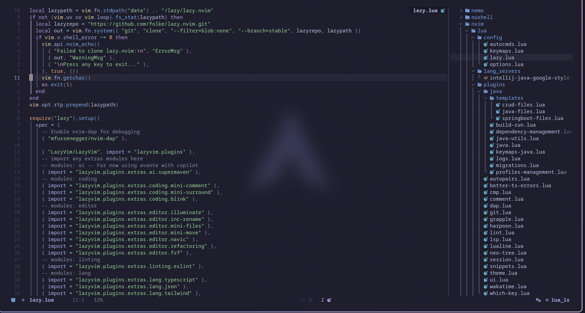
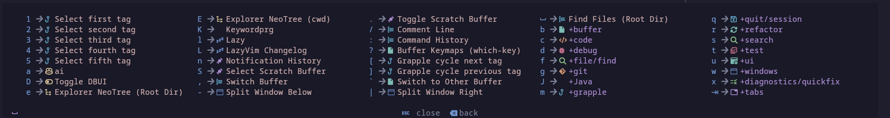
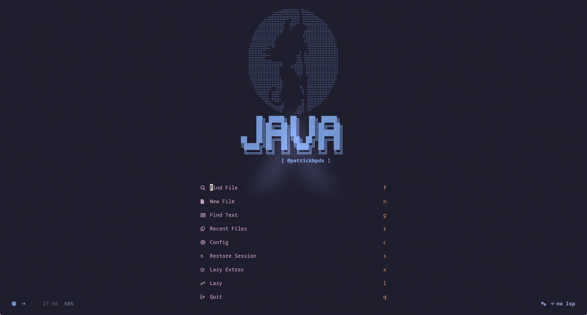

# 🚀 Patrick's Neovim Configuration

[](https://github.com/Patrickbpds/my-dotfiles/stargazers)

A modern, feature-rich Neovim configuration optimized for Java development and full-stack programming. Built with LazyVim, featuring LSP integration, debugging capabilities, and a curated plugin ecosystem for maximum productivity.

## 🖼️ Preview
### 🎨 Neovim Configuration Interface


### ☕ Development Environment


### 🔧 Neovim Interface


## ✨ Features

- **🚀 LazyVim Integration** - Modern plugin management with lazy loading
- **☕ Java Excellence** - Full JDTLS support with Spring Boot, Maven/Gradle integration
- **🔧 LSP & DAP** - Language servers and debugging for multiple languages
- **🎨 Beautiful UI** - Carefully selected themes and UI enhancements
- **⚡ Performance** - Optimized startup times and memory usage
- **📚 Learning Friendly** - Comprehensive keymaps guide included

## 📋 What's Included

### 🎯 Core Configuration
- **LazyVim Base** - Modern Neovim distribution with batteries included
- **50+ Plugins** - Curated selection for productivity and development
- **Multi-Language Support** - Java, TypeScript, Python, Lua, and more
- **Custom Keymaps** - Intuitive shortcuts with comprehensive learning guide

### ☕ Java Development Suite
- **JDTLS Integration** - Full Java language server with Eclipse quality
- **Spring Boot Tools** - Dedicated support for Spring Boot development
- **Build Systems** - Maven and Gradle integration with one-click execution
- **Testing Framework** - LazyVim's built-in testing integration for JUnit
- **Code Actions** - LazyVim's LSP-powered refactoring and quick fixes
- **Database Tools** - Flyway migration support and database integration

### 🔧 Development Tools
- **LSP Integration** - Intelligent code completion and diagnostics
- **DAP Debugging** - Integrated debugging with breakpoints and variable inspection
- **Git Integration** - Lazygit, inline blame, and diff viewing
- **Code Formatting** - Prettier integration with automatic formatting on save
- **Snippet Support** - Code snippets for faster development

## 🚀 Installation

### 📋 System Requirements

#### Installation Commands

**Ubuntu/Debian:**
```bash
# Required
sudo apt update
sudo apt install neovim git stow

```

**macOS (Homebrew):**
```bash
# Required
brew install neovim git stow

```

**Arch Linux:**
```bash
# Required
sudo pacman -S neovim git stow

```

### 🛠️ Quick Install

```bash
# Clone repository (you can choose any directory)
git clone https://github.com/Patrickbpds/my-dotfiles.git ~/.dotfiles
cd ~/.dotfiles

# Alternative: clone to current directory
# git clone https://github.com/Patrickbpds/my-dotfiles.git .
# cd my-dotfiles

# Backup existing config (recommended)
mkdir -p ~/.config-backup
cp -r ~/.config/nvim ~/.config-backup/ 2>/dev/null || true

# Install configuration
stow -v -R -t ~/.config nvim

# Install plugins (first run will take longer)
nvim --headless -c 'Lazy sync' +qa
```

### 📦 Manual Installation (Alternative)

If you prefer not to use GNU Stow:

```bash
# Clone and copy files
git clone https://github.com/Patrickbpds/my-dotfiles.git ~/.dotfiles
cp -r ~/.dotfiles/nvim ~/.config/

# Install plugins
nvim
# Run :Lazy sync inside Neovim
```

### 🎯 First Run

```bash
# Open Neovim
nvim

# Install LSP servers (inside Neovim)
:MasonInstall java-language-server jdtls typescript-language-server

# Verify installation
:checkhealth
:Lazy sync
```

## ⚡ Key Features

### 🚀 Performance & UX
- **⚡ Fast Startup** - Optimized lazy loading keeps startup under 100ms
- **🎨 Beautiful UI** - Carefully crafted themes and modern interface
- **📱 Responsive** - Works seamlessly on different screen sizes
- **🔄 Auto Updates** - Plugins update automatically in background

### 💻 Development Experience

#### LSP Integration
- ✅ **Multi-language Support** - Java, TypeScript, Python, Lua, Go, Rust
- ✅ **Intelligent Completion** - Context-aware code suggestions
- ✅ **Real-time Diagnostics** - Instant error checking and warnings
- ✅ **Code Actions** - Quick fixes and refactoring tools

#### Java Excellence
- ☕ **JDTLS Server** - Full Eclipse-quality Java support with LazyVim integration
- 🚀 **Spring Boot** - Dedicated Spring Boot development tools
- 🔨 **Build Integration** - Maven/Gradle with one-click execution
- 🧪 **Testing** - LazyVim's built-in testing framework for seamless JUnit integration
- ⚙️ **Code Actions** - LazyVim's LSP-powered refactoring and code actions
- 🗄️ **Database Tools** - Flyway migrations and database integration

#### Debugging & Testing
- 🐛 **DAP Integration** - Debug directly in Neovim
- 🔴 **Breakpoints** - Visual breakpoint management
- 👀 **Variable Inspection** - Watch expressions and variables
- 🧪 **Test Runner** - Integrated testing framework

### 🎨 UI & Navigation
- 🌈 **Themes** - Multiple themes with automatic switching
- 📊 **Status Line** - Rich status bar with LSP and Git info
- 📁 **File Explorer** - Tree-style navigation with Git integration
- 🔍 **Fuzzy Finding** - Fast file and content search
- 📌 **Session Management** - Automatic workspace saving

### 📚 Learning Resources

📖 **[Complete Keymaps Learning Guide](KEYMAPS_LEARNING.md)** - Interactive guide to master all shortcuts

🎯 **Pro Tips:**
- Use `<leader>?` to see all available keymaps
- Press `<leader>` and wait to see WhichKey hints
- Check `:help lazyvim` for LazyVim documentation

## 🔧 Customization

### Modifying Configurations
Edit files directly in the stow directories:
```bash
# Edit Neovim config
vim nvim/lua/config/options.lua

# Restow to apply changes
stow -R -t ~/.config nvim
```

### Adding New Configurations
```bash
# Create new package directory
mkdir -p mypackage/.config/myapp

# Add your config files
cp ~/.config/myapp/config mypackage/.config/myapp/

# Stow the new package
stow mypackage
```

## 📁 Project Structure

```
my-dotfiles/
├── 📁 nvim/                        # 🏠 Complete Neovim configuration
│   ├── 📄 init.lua                  # 🚀 Main initialization file
│   ├── 📄 lazyvim.json              # ⚙️ LazyVim configuration
│   ├── 📄 lazy-lock.json            # 🔒 Plugin lockfile
│   ├── 📄 stylua.toml               # 💅 Lua formatter config
│   ├── 📄 .neoconf.json             # 🔧 Neoconf settings
│   ├── 📄 .gitignore                # 🚫 Git ignore rules
│   └── 📁 lua/
│       ├── 📁 config/               # ⚙️ Core configurations
│       │   ├── 📄 autocmds.lua      # 🤖 Auto commands
│       │   ├── 📄 keymaps.lua       # ⌨️ Key mappings
│       │   ├── 📄 lazy.lua          # 📦 Plugin manager
│       │   ├── 📄 options.lua       # 🔧 Neovim options
│       │   └── 📄 lazyvim.json      # ⚙️ LazyVim config
│       ├── 📁 lang_servers/         # 🗣️ Language server configs
│       │   └── 📄 intellij-java-google-style.xml
│       └── 📁 plugins/              # 🔌 Plugin configurations
│           ├── 📁 java/             # ☕ Java-specific plugins
│           │   ├── 📄 build-run.lua
│           │   ├── 📄 dependency-management.lua
│           │   ├── 📄 java.lua
│           │   ├── 📄 java-utils.lua
│           │   ├── 📄 keymaps-java.lua
│           │   ├── 📄 logs.lua
│           │   ├── 📄 migrations.lua
│           │   ├── 📄 profiles-management.lua
│           │   └── 📁 templates/
│           │       ├── 📄 crud-files.lua
│           │       ├── 📄 java-files.lua
│           │       └── 📄 springboot-files.lua
│           ├── 📄 autopairs.lua      # 🔄 Auto pairs
│           ├── 📄 better-ts-errors.lua # 🚨 Better TS errors
│           ├── 📄 cmp.lua            # 💡 Completion
│           ├── 📄 comment.lua        # 💬 Commenting
│           ├── 📄 dap.lua            # 🐛 Debug adapter
│           ├── 📄 git.lua            # 🐙 Git integration
│           ├── 📄 grapple.lua        # 🪝 Fast navigation
│           ├── 📄 harpoon.lua        # ⚓ File marking
│           ├── 📄 lint.lua           # 🔍 Linting
│           ├── 📄 lsp.lua            # 🗣️ Language server
│           ├── 📄 lualine.lua        # 📊 Status line
│           ├── 📄 neo-tree.lua       # 📁 File explorer
│           ├── 📄 session.lua        # 💾 Session management
│           ├── 📄 snippets.lua       # 📝 Code snippets
│           ├── 📄 theme.lua          # 🎨 Color scheme
│           ├── 📄 ui.lua             # 🖼️ UI enhancements
│           ├── 📄 wakatime.lua       # ⏱️ Time tracking
│           └── 📄 which-key.lua      # ❓ Key hinting
├── 📄 KEYMAPS_LEARNING.md           # 📚 Keymaps learning guide
└── 📄 README.md                     # 📖 This documentation
```

### 🎯 Key Directories Explained

- **`nvim/lua/config/`** - Core Neovim settings and LazyVim configuration
- **`nvim/lua/plugins/`** - All plugin configurations and customizations
- **`nvim/lua/plugins/java/`** - Java-specific tools and integrations
- **`KEYMAPS_LEARNING.md`** - Interactive guide to learn all keyboard shortcuts

## 🔄 Management Commands

### Useful Stow Commands

```bash
# Install/link configurations
stow -t ~/.config nvim

# Remove/unlink configurations
stow -D -t ~/.config nvim

# Reinstall (useful after editing)
stow -R -t ~/.config nvim

# Simulate actions (dry run)
stow -n -t ~/.config nvim

# Verbose output
stow -v -t ~/.config nvim
```

### Maintenance

```bash
# Check for broken symlinks
find ~ -xtype l -print

# Update from git
git pull origin main

# Restow after updates
stow -R -t ~/.config nvim

# Clean broken symlinks
find ~ -maxdepth 1 -name ".*" -type l ! -exec test -e {} \; -delete 2>/dev/null || true
```

## 🔧 Troubleshooting

### 🚨 Common Issues & Solutions

#### LSP Not Working
```bash
# Check LSP status
:LspInfo

# Install missing servers
:MasonInstall java-language-server jdtls typescript-language-server

# Restart LSP
:LspRestart
```

#### Java Development Issues
```bash
# Check JDTLS status
:JdtShowLogs

# Refresh project
:JdtRefresh

# Recompile
:JdtCompile
```

#### Plugin Problems
```bash
# Sync all plugins
:Lazy sync

# Clear plugin cache
:Lazy clean

# Reinstall all plugins
:Lazy restore
```

#### Performance Issues
```bash
# Check health
:checkhealth

# Profile startup time
:StartupTime

# Disable heavy plugins temporarily
:LazyExtras
```

#### UI/Theme Problems
```bash
# Reload theme
:colorscheme <theme-name>

# Check syntax highlighting
:syntax on

# Reload UI
:lua require('lazy').reload('ui')
```

### 🔍 Advanced Debugging

#### Debug Mode
```bash
# Start Neovim in debug mode
NVIM_DEBUG=1 nvim

# Check LazyVim debug info
:Lazy profile
```

#### Log Files
```bash
# LSP logs
~/.local/state/nvim/lsp.log

# LazyVim logs
~/.local/state/nvim/lazy.log

# Neovim logs
~/.local/state/nvim/log
```

#### System Information
```bash
# Neovim version and build
nvim --version

# Check dependencies
:checkhealth provider

# Plugin status
:Lazy
```

### 🛟 Getting Help

1. **Check the logs** - Most issues are logged with detailed error messages
2. **Update everything** - Run `:Lazy sync` and restart Neovim
3. **Minimal config** - Test with `nvim --clean` to isolate issues
4. **Community** - Check [Neovim Discourse](https://neovim.discourse.group/) or [LazyVim issues](https://github.com/LazyVim/LazyVim/issues)

### 🔄 Recovery Steps

If everything breaks:
```bash
# Remove configuration
rm -rf ~/.config/nvim

# Restore backup
cp -r ~/.config-backup/nvim ~/.config/

# Reinstall
stow -R .config
```


## 🤝 Contributing

Contributions are welcome! Please feel free to:

- 🐛 **Report Issues** - Found a bug? Let me know!
- 💡 **Suggest Features** - Have an idea? Share it!
- 🔧 **Submit PRs** - Want to contribute code? Awesome!
- 📖 **Improve Docs** - Help make the documentation better

## 🙏 Acknowledgments

### Core Technologies
- **[Neovim](https://neovim.io/)** - The best text editor
- **[LazyVim](https://github.com/LazyVim/LazyVim)** - Amazing distribution
- **[GNU Stow](https://www.gnu.org/software/stow/)** - Perfect dotfile management

### Community & Inspiration
- **LazyVim Community** - For the incredible ecosystem
- **Neovim Community** - For pushing the boundaries
- **Dotfile Enthusiasts** - For sharing knowledge and inspiration

---

*"The best tools are invisible. They get out of your way and let you focus on what matters - creating amazing software."*

---

## 📞 Support

- 🐙 **GitHub Issues**: [Issues](https://github.com/Patrickbpds/my-dotfiles/issues)
- 💬 **Discussions**: [Discussions](https://github.com/Patrickbpds/my-dotfiles/discussions)

---

**⭐ Star this repo if you find it useful!**
